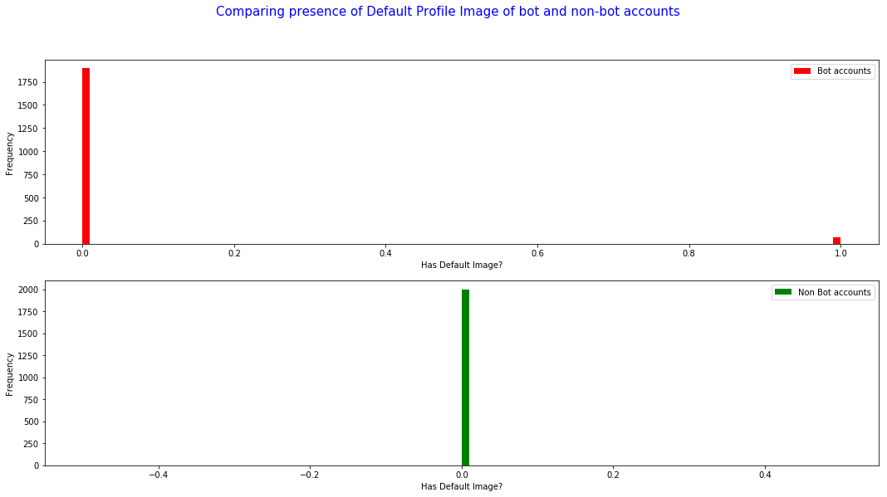

### CSCI S-109a - Introduction To Data Science - Final Project
### Contributors: [Karan Bhandarkar](mailto:karanbhandarkar@gmail.com), [Vivek Mishra](mailto:iblpvivek@icloud.com)

  
### [Welcome](README.md)&emsp;|&emsp;[**_Introduction and EDA_**](intro-and-eda.md)&emsp;|&ensp;[Literature Review](lit-review.md)&emsp;|&emsp;[Models](models.md)&emsp;|&emsp;[Summary](summary.md)

## Content:
- [Data Resources](#data-resources)
- [EDA](#eda) 
  * [Ratio of Friends Count to Followers Count](#ratio-of-friends-count-to-followers-count)  
  * [List Counts of Bots and Non-Bots](#list-counts-of-bots-and-non-bots)  
  * [Verified Status of Bots and Non-Bots](#verified-status-of-bots-and-non-bots)  
  * [Tweets per Day](#tweets-per-day)  
  * [Extended Profile](#extended-profile)  
  * [Default Profile Image](#default-profile-image)  
  * [Default Profile](#default-profile)  
  * [Word Cloud](#word-cloud)  
- [Key Features](#key-features)

  
### Data Resources

We will collect our own data for this project. We were provided a basic Python script, tweepy_script.ipynb, that utilizes the tweepy library to access the Twitter API. We have significantly modified this script to fetch user details and user tweets. This process is detailed in the TwitterDataPreProcessing.ipynb submitted.

We have taken 50 accounts that tweet financial information and 50 bot accounts from different categories(to understand bot behavior). Getting hold of more accounts is difficult, especially bot accounts since Twitter has been clamping down, so we have bootstrapped to increase the user details dataset(shown in TwitterDataEDA.ipynb). 

Tweet details contain many details, most of which can be eyeballed and considered trivial. We have cleaned up these column to focus our EDA on specific columns (shown in TwitterDataEDA.ipynb). 

[Back to top](#content)

### EDA

#### Ratio of Friends Count to Followers Count

In the real world, it is common to follow a lot more accounts than the number that follow you. People follow celebrity accounts, public figure accounts, company accounts and a lot more. Bots however, show a distict behaviour. They either are followed by close to none, or follow close to no accounts.

[Back to top](#content)

#### List Counts of Bots and Non-Bots

This is obviously another indicator of popularity – the more lists you are on, the more popular you probably are. There is a clear distinction in the disctribution of this feature between bots and non-bots. Non-bots seem to have a kind of uniform distribution with tapering frequency at hight counts. The distribution of bots seems to be concentrated at the lower end of the counts spectrum.

[Back to top](#content)

#### Verified Status of Bots and Non-Bots

As expected, non-bot accounts have examples of verified as well as not-verified accounts and bot accounts are always not-verified. Well, almost. Though, through further exploration, we noted that the small sample of 'verified' in the bots' histogram belongs to DFRLabs which has a bot twitter account but is a credible verified source.

A credible verified source bot, like possibly a newspaper's account, does not qualify as a bot for our intents and purposes. Thus, DFRLab and it's tweets were dropped from the datasets.

[Back to top](#content)

#### Tweets per Day

A key identification factor for bots v/s non-bots is the number of tweets per day. The majority of the non-bots data lies in the 0-12 range, whereas the majority of the bots data lies in the 0-100 range. This is a major anomoly to help our cause.

[Back to top](#content)

#### Extended Profile

     
The presence of an extended profile does not seem to be of significance. The distribution in true and false classes seems to be pretty similar in bots and non-bots. This comes as a suprise.
     
[Back to top](#content)

#### Default Profile Image

Default profile image doesn't seem to be a significant feature. The small population of bots could be attributed to noise or could be considered a sign of being a bot, since non-bots have no accounts with default profile images. This could also just be a case of representations in sampled data and maybe there are non-bot accounts with default profile images too. Hence, we will consider this feature to be insignificant.

[Back to top](#content)

#### Default Profile

Bot accounts have a much higher likelihood of having a default profile. It drops from over 50% in bots to under 25% in non-bots. Having a default profile, is hence a strong indicator of a bot. 

[Back to top](#content)

#### Word Cloud

 

 

We can see that the non bots accounts have more meaning full text vs bot accounts are verbiage in some kind which is kind of what you would expect since most bot tweets are very short scripted with a youtube url ta or some link

[Back to top](#content)

### Key Features

Based on the EDA, a new dataset is created with only features deemed significant through plotting. These features are engineering from our initial set of features as:
- Ratio of Friends Count to Followers Count
- List Counts of Bots and Non-Bots
- Verified Status of Bots and Non-Bots
- Tweets per Day
- Default Profile
- Statuses

We check for any obvious correlation and then proceed.

[Back to top](#content)
