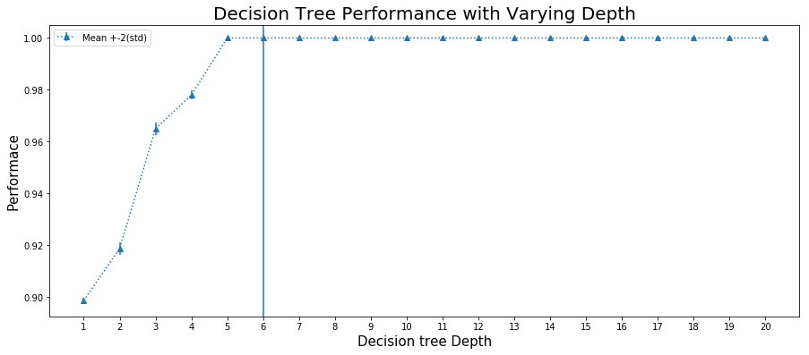
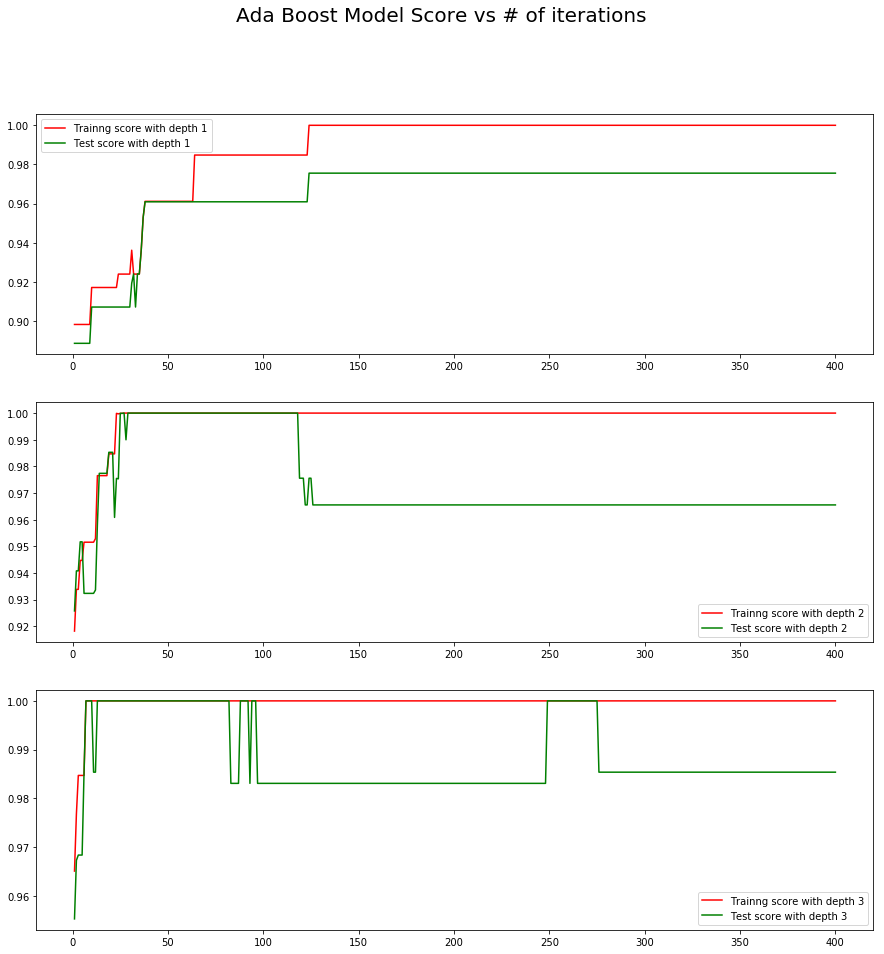
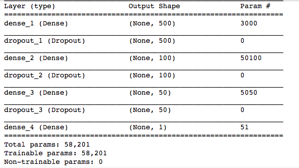
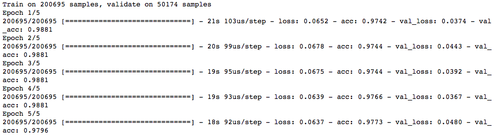

### CSCI S-109a - Introduction To Data Science - Final Project
### Contributors: [Karan Bhandarkar](mailto:karanbhandarkar@gmail.com), [Vivek Mishra](mailto:iblpvivek@icloud.com)

  
### [Welcome](README.md)&emsp;|&emsp;[Introduction and EDA](intro-and-eda.md)&emsp;|&ensp;[Literature Review](lit-review.md)&emsp;|&emsp;[**_Models_**](models.md)&emsp;|&emsp;[Summary](summary.md)

## Content:
- Data Modelling
  * [Logistic Regression Model](#logistic-regression-model)
  * [Logistic Regression with Cross Validation](#logistic-regression-with-cross-validation)
  * [Logistic Regression with Polynomials of Degree 3](#logistic-regression-with-polynomials-of-degree-3)
  * [Decision Tree Classifier](#decision-tree-classifier)
  * [Random Forest Classifier](#random-forest-classifier)
  * [Boosting AdaBoost Classifier](#boosting-adaboost-classifier)
  * [Ensemble Modelling](#ensemble-modelling)
  * [Neural Networks](#neural-networks)

  
### Logistic Regression Model

~~~~
from sklearn.linear_model import LogisticRegression

model_collection = {}

logit_model = LogisticRegression().fit(X_train, y_train)

logistic_model_score = logit_model.score(X_test, y_test)

model_collection["simple_logistic"] = logit_model

print("Train set score: {0:4.4}%".format(logit_model.score(X_train, y_train)*100))
print("Test set score: {0:4.4}%".format(logit_model.score(X_test, y_test)*100))
~~~~
Train set score: 89.52%  
Test set score: 89.62%

Our Test score is 91% which is not bad for a Base Model considering our worst chance is 50%

[Back to top](#content)

### Logistic Regression with Cross Validation

~~~~
from sklearn.linear_model import LogisticRegressionCV
logic_model_cv = LogisticRegressionCV(Cs=[1,10,100,1000,10000], cv=3, penalty='l2', 
                                       solver='newton-cg').fit(X_train,y_train)

model_collection["simple_logistic_CV"] = logic_model_cv
print("Test set score with Cross Validation: {0:4.4}%".format(logic_model_cv.score(X_test, y_test)*100))
~~~~
Test set score with Cross Validation: 92.56%

Cross validation with Regularization is giving us ~ 85 % accuracy which is an improvement from the base model, and We would like to see how we can improve this further.

[Back to top](#content)

### Logistic Regression with Polynomials of Degree 3

~~~~
from sklearn.preprocessing import PolynomialFeatures

X_train_poly = PolynomialFeatures(degree=3, include_bias=False).fit_transform(X_train)
X_test_poly = PolynomialFeatures(degree=3, include_bias=False).fit_transform(X_test)

logic_model_poly_cv = LogisticRegressionCV(Cs=[1,10,100,1000,10000], cv=3, penalty='l2', 
                                       solver='newton-cg').fit(X_train_poly,y_train)

model_collection["poly_logistic_cv"] = logic_model_poly_cv

print("Test set score with Polynomial Features and with Cross Validation: {0:4.4}%".
      format(logic_model_cv.score(X_test, y_test)*100))
~~~~
Test set score with Polynomial Features and with Cross Validation: 92.56%

Test score is much better now with Polynomial degree of predictors, We will continue to look for improvements with other different models that we learned in the class.

[Back to top](#content)

### Decision Tree Classifier

We are going to look at how Decision Tree Classifier fits into our data set, we are going to look at multiple depths and use cross validation score method of sklearn to find out which depth fits perfect and not overfit.
~~~~
from sklearn.tree import DecisionTreeClassifier
from sklearn.model_selection import cross_val_score
fig, ax = plt.subplots(1,1, figsize=(15,6))
x = list(range(1,21))
means = []
stds = []
for cur_depth in range(1,21):
    decision_tree_model = DecisionTreeClassifier(max_depth = cur_depth)
    scores = cross_val_score(decision_tree_model, X_train, y_train, cv=5)
    means.append(np.mean(scores))
    stds.append(2*np.std(scores))
    
ax.errorbar(x, means, stds, marker='^', linestyle='dotted', label="Mean +-2(std)")
#ax.plot(x,means,'o',color="g")
ax.set_xticks(x)
ax.axvline(x=6)
ax.set_xlabel("Decision tree Depth", fontsize=15)
ax.set_ylabel("Performace", fontsize=15)
ax.set_title("Decision Tree Performance with Varying Depth", fontsize=20)
ax.legend()
~~~~

Looking at the above graph looks like depth 6 seems to be perfect for our data. So we are going to use that depth to build our model and try testing it on the test data set.

~~~~
from sklearn.tree import DecisionTreeClassifier
from sklearn.model_selection import cross_val_score

decision_tree_model = DecisionTreeClassifier(max_depth = 6).fit(X_train, y_train)

model_collection["decision_tree"] = decision_tree_model
score = decision_tree_model.score(X_test, y_test)

print("Decision Tree Classifier Model score for test data: {0:4.4}%".format(score*100))
~~~~
Decision Tree Classifier Model score for test data: 97.08%
 
Our decision tree seems to be peforming very poorly compared to other models, There are mulitple strategies that we have learnt in the class, we can apply Boosting , Bagging and Prunning to improve the results of the decision tree

[Back to top](#content)

### Random Forest Classifier

~~~~
from sklearn.ensemble import RandomForestClassifier

rf = RandomForestClassifier(n_estimators=25, max_depth=6)
rf_model = rf.fit(X_train, y_train)
score = rf_model.score(X_test, y_test)

model_collection["random_forest"] = random_forest_model

print("Random Forest model score is ", score)
~~~~
Random Forest model score is  0.9702

[Back to top](#content)

### Boosting AdaBoost Classifier

~~~~
from sklearn import ensemble
from sklearn import tree

fig, ax = plt.subplots(3,1, figsize=(15,15))
estimators_num = 400
x_labels=range(1,estimators_num+1)
ada_scores_test = []
ada_scores_train = []
for depth in range(1,4):
    adaboost = ensemble.AdaBoostClassifier(tree.DecisionTreeClassifier(max_depth=depth), 
                                           n_estimators=estimators_num, learning_rate=.05)
    adamodel = adaboost.fit(X_train, y_train)
    
    ax[depth-1].plot(list(x_labels),list(adamodel.staged_score(X_train,y_train)),color="r",
                     label="Trainng score with depth {}".format(depth))
    ax[depth-1].plot(list(x_labels),list(adamodel.staged_score(X_test,y_test)),color="g", 
                     label="Test score with depth {}".format(depth))
    ax[depth-1].legend()
    
fig.suptitle("Ada Boost Model Score vs # of iterations", fontsize=20)
    
~~~~

[Back to top](#content)

### Ensemble Modelling

~~~~
from sklearn.utils import resample
emsemble_train = pd.DataFrame()
emsemble_test = pd.DataFrame()
for model_name, model in model_collection.items():
    if(model_name=="poly_logistic_cv"):
        y_predict = model.predict(X_train_poly)
    elif():
         y_predict = model.predict(X_train)
    
    emsemble_train[model_name] = y_predict
    
    if(model_name=="poly_logistic_cv"):
        y_predict_test = model.predict(X_test_poly)
    elif():
         y_predict_test = model.predict(X_test)
    
    emsemble_test[model_name] = y_predict_test
~~~~

~~~~
from sklearn.metrics import accuracy_score
meta_test_predictions = np.mean(emsemble_test,axis=1) >.5 #do we have more than 50% 1s?
accuracy_score(y_test, meta_test_predictions)
score =  accuracy_score(y_test, meta_test_predictions)
print("Decision Tree Classifier Model score for test data: {0:4.4}%".format(score*100))
~~~~
Decision Tree Classifier Model score for test data: 98.45%

[Back to top](#content)

### Neural Networks

~~~~
from keras.models import Sequential
from keras.layers import Dense
from keras.layers import Dropout

model = Sequential([
    Dense(500, input_shape=(5,), activation='relu'),
    Dropout(.5),
    Dense(100, activation='relu'),
    Dropout(.5),
    Dense(50, activation='relu'),
    Dropout(.5),
    Dense(1, activation='sigmoid')
])
~~~~
~~~~
model.summary()
~~~~

~~~~
model.compile(loss='binary_crossentropy', optimizer='adam', metrics=['accuracy'])

model.fit(X_train, y_train, epochs=5, batch_size=32, validation_split = .2)
~~~~

~~~~
print(model.evaluate(X_test, y_test))
~~~~
83624/83624 [==============================] - 2s 26us/step

[0.02736951490943521, 0.9992029082560031]

The accuracy and loss here is extremely impressive.

[Back to top](#content)
